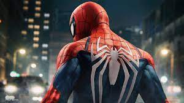

#   SPIDER-MAN

- Spiderman
Spider-Man, traducido en ocasiones como el Hombre Araña,11​12​ es un personaje creado por los estadounidenses Stan Lee y Steve Ditko,13​14​ e introducido en el cómic Amazing Fantasy n.°15, publicado por Marvel Comics en agosto de 1962.

[Enlace hacia atras](./index.md)
[Enlace hacia adelante](./pagina2.md)