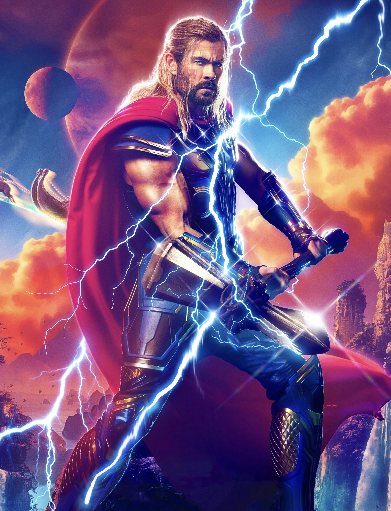

#   THOR

- Thor
Thor es un superhéroe ficticio que aparece en los cómics estadounidenses publicados por Marvel Comics. Es el dios del trueno asgardiano basado en la deidad homónima, del pueblo ficticio inspirado en el mundo de Asgard de la mitología nórdica. 

<iframe width="900" height="350" src="https://www.youtube.com/embed/Ob7WlTR-IPw" title="Thor llega a Wakanda  Castellano-HD" frameborder="0" allow="accelerometer; autoplay; clipboard-write; encrypted-media; gyroscope; picture-in-picture; web-share" allowfullscreen></iframe>

[Enlace hacia atras](./pagina1.md)
[Enlace hacia adelante](./pagina3.md)
